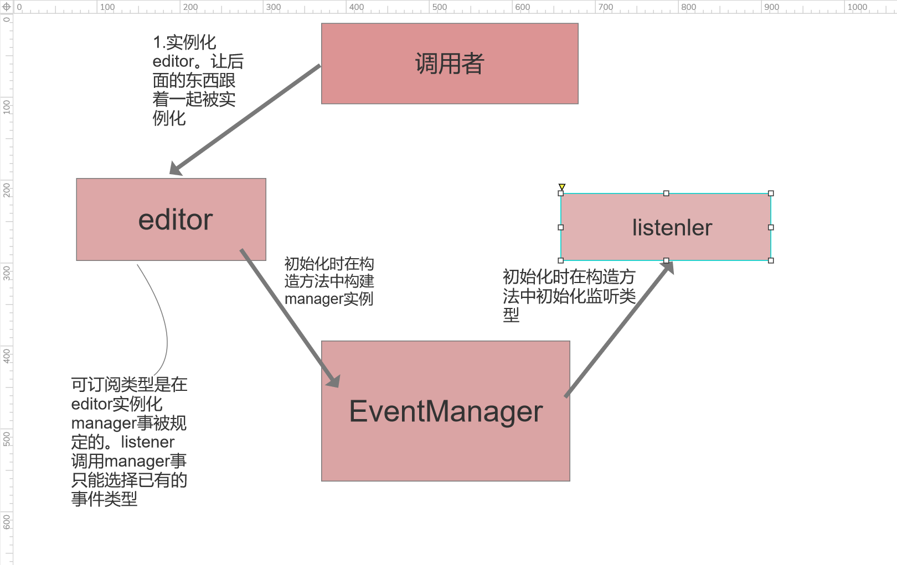

Link:https://refactoringguru.cn/design-patterns/observer

观察者模式有四个主体而不是三个。调用者容易被忽略。

调用者-消费者（完成订阅和订阅者接口实例化）

Editor-实体

EventManager-发布者

Litener-订阅者

```
public class Demo {
public static void main(String[] args) {
Editor editor = new Editor();
editor.events.subscribe("open", new LogOpenListener("/path/to/log/file.txt"));
editor.events.subscribe("save", new EmailNotificationListener("admin@example.com"));
try {
editor.openFile("test.txt");
editor.saveFile();
} catch (Exception e) {
e.printStackTrace();
}
}
}
```
在实际的代码中实体初始化，订阅，和时间触发不会在同一代码块内。
可能是从ioc中取出实例引用后调用订阅方法完成订阅。并在另外的位置完成触发

实体类方法中每个方法需硬编触发事件的组（定义需要通知哪些用户）
