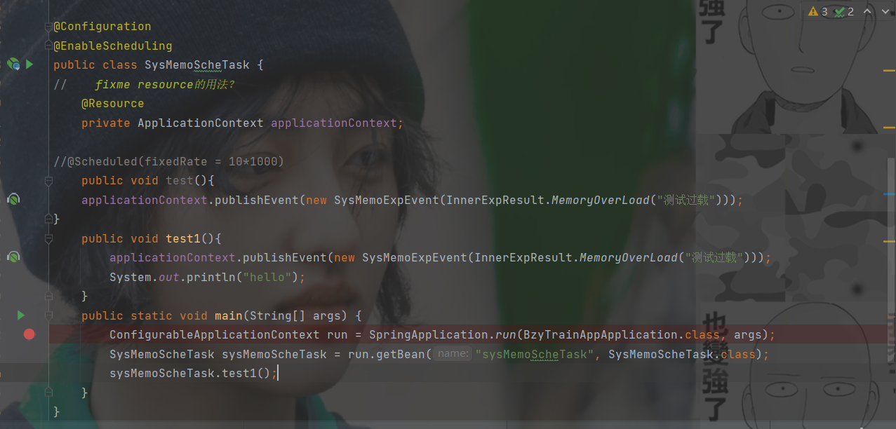
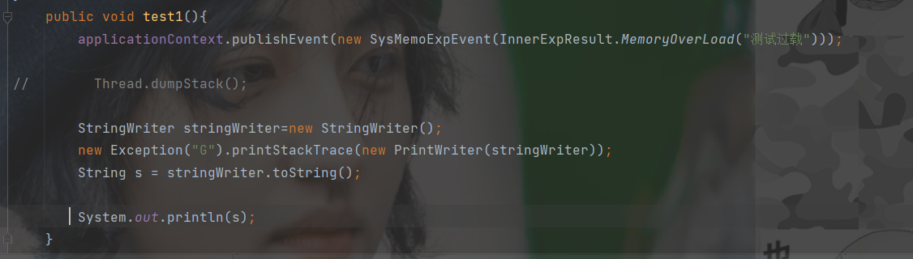

#日志技巧
程序员可见的日志。如性能检测等可以用低等级的日志(如finner等)
# 日志关键字
日志记录器,日志处理器,格式器，过滤器(过滤器不是web的专属
#注意事项
原生的log是不会输出调用栈的。需要在参数中加入对应的异常。或则占位符填充给
日志记录器使用静态常量保存防止被回收
# 测试技巧
#Spring单元测试技巧
可以直接在所属类下面加main方法作为测试桩
如下:
  
通过手动从容器取出bean然后测试(因为main方法为static是无法直接调用非static方法的
bean的命名规则默认首字母小写。但是如果类的前两个字母都是大写的话就不用小写
#调用栈获取技巧

通过创建异常但不抛出获取调用栈并print流输出到String中。
#遗留问题
logger的 throwing()
         entering()
         exitingg()
         方法 使用
过滤器和格式器的编写

